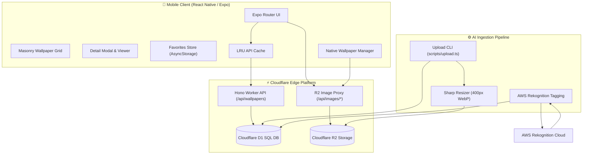
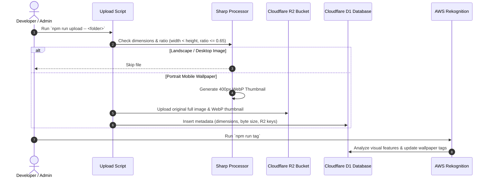

# 🖼️ Wallepi — Next-Gen Android Wallpaper App

[](https://expo.dev)
[](https://reactnative.dev)
[](https://workers.cloudflare.com)
[](https://hono.dev)
[](https://aws.amazon.com/rekognition/)
[](LICENSE)

**Wallepi** is a high-performance, aesthetically crafted mobile wallpaper application for Android. Built with a modern **React Native / Expo** frontend and powered by a serverless **Cloudflare Workers** backend with **Cloudflare D1** SQL and **Cloudflare R2** object storage, Wallepi delivers instant wallpaper discovery, AI-driven categorization, dual-tier image caching, and native Android wallpaper setting.

---

## ✨ Key Features

- 📱 **Mobile-First Curation**: Automated aspect-ratio filtering ($\le 0.65$) ensures only high-quality portrait wallpapers tailored for mobile screens are ingested.
- ⚡ **Dual-Tier Image Delivery & BlurHash**:
  - **`expo-image` Native Rendering**: Utilizes native image engines (Glide on Android / SDWebImage on iOS) with `memory-disk` cache policies and instant transition rendering to prevent flicker.
  - **BlurHash Placeholders**: Instant UI feedback before image payload arrives over network.
  - **400px WebP Thumbnails**: Micro-sized for rapid grid scrolling and ultra-low memory consumption.
  - **Full-Resolution R2 Images**: High-resolution imagery streamed on-demand via Cloudflare R2 with ETag and cache headers.
- 🚀 **High-Efficiency D1 Indexing**:
  - Composite indexes `(is_active, created_at DESC)` and `(is_active, category, created_at DESC)` ensure $O(\text{limit})$ index range scans, reducing database read load by over 95%.
- 🎨 **Modern Aesthetics & Glassmorphism**:
  - **Expo Router** file-based navigation.
  - Floating frosted-glass navigation bar utilizing `expo-blur`.
  - Seamless animated splash screen overlay transition on app startup.
- 🤖 **AI-Powered Image Tagging**: Integrated AWS Rekognition pipeline automatically analyzes wallpaper visual features and applies metadata tags.
- 💾 **Offline Favorites & LRU Cache**: Local storage via `AsyncStorage` for favorited wallpapers and in-memory LRU API caching.
- 🖼️ **Native Android Integration**: Set wallpapers directly to Home Screen, Lock Screen, or both with custom native bridging.

---

## 🏗️ System Architecture

Wallepi is structured into three decoupled layers: **Mobile Client**, **Cloudflare Edge Backend**, and **Ingestion Pipeline**.

### Overall System Flow



### Ingestion & Processing Pipeline



---

## 📁 Repository Structure

```
wallepi/
├── src/                          # 📱 React Native / Expo Mobile App
│   ├── app/                      # Expo Router screens (index, explore, favorites)
│   │   ├── _layout.tsx           # Root layout, theme, and blur navbar provider
│   │   ├── index.tsx             # Home: Wallpaper of the Day + Masonry Grid
│   │   ├── explore.tsx           # Search & Category Exploration
│   │   └── favorites.tsx         # Saved Wallpapers Screen
│   ├── components/               # UI Components
│   │   ├── FloatingNavBar.tsx    # Glassmorphic bottom navigation
│   │   ├── WallpaperGrid.tsx     # Paginated masonry layout
│   │   ├── DetailModal.tsx       # Wallpaper viewer & download sheet
│   │   └── AnimatedSplashOverlay.tsx # Custom launch screen animation
│   ├── services/                 # Business & API logic
│   │   ├── api.ts                # Cloudflare API client
│   │   └── wallpaperManager.ts   # Native Android wallpaper setter
│   └── lib/                      # Utilities (cacheManager, favoritesStore)
│
├── wallepi-backend/              # ⚡ Cloudflare Worker Backend & CLI Tools
│   ├── src/
│   │   ├── index.ts              # Hono REST API server
│   │   └── types.ts              # Shared backend TypeScript types
│   ├── scripts/
│   │   ├── upload.ts             # Local folder → R2/D1 bulk uploader
│   │   ├── image-tagging.ts      # AWS Rekognition AI tagging
│   │   └── deduplicate.ts        # Image deduplication utility
│   ├── schema.sql                # D1 SQL database schema
│   └── wrangler.toml             # Cloudflare Worker configuration
```

---

## 🚀 Getting Started

### Prerequisites

- [Node.js](https://nodejs.org/) (v18 or higher)
- [Expo CLI](https://docs.expo.dev/) (`npm i -g expo-cli`)
- [Cloudflare Wrangler CLI](https://developers.cloudflare.com/workers/wrangler/get-started/) (`npm i -g wrangler`)
- Android Studio / Emulator (or a physical Android device)

---

### 1. Mobile App Setup (Frontend)

1. Clone the repository:
   ```bash
   git clone https://github.com/dawoodshah04/wallepi-app.git
   cd wallepi
   ```

2. Install dependencies:
   ```bash
   npm install
   ```

3. Start the Expo development server:
   ```bash
   npm start
   ```

4. Launch on Android:
   ```bash
   npm run android
   ```
   > 💡 **Note**: Native features like setting wallpapers require running on a physical Android device or emulator via `npm run android` rather than Expo Go.

---

### 2. Backend Setup (Cloudflare Worker)

1. Navigate to the backend folder:
   ```bash
   cd wallepi-backend
   npm install
   ```

2. Authenticate Wrangler with Cloudflare:
   ```bash
   npx wrangler login
   ```

3. Create the Cloudflare R2 bucket and D1 Database:
   ```bash
   npx wrangler r2 bucket create wallpapers
   npx wrangler d1 create wallpaper-manifest
   ```

4. Apply the SQL database schema:
   ```bash
   npm run db:init
   ```

5. Start local backend server:
   ```bash
   npm run dev
   ```
   The local API will run at `http://localhost:8787`.

6. Deploy to Cloudflare Workers:
   ```bash
   npm run deploy
   ```

---

## 📤 Ingestion & AI Pipeline

### Uploading Wallpapers

Place your high-resolution portrait images in a local folder and run the bulk upload script:

```bash
cd wallepi-backend
npm run upload -- "C:\Path\To\Your\Wallpapers"
```

The script automatically:
- Inspects dimensions and skips non-portrait images ($aspect\_ratio > 0.65$).
- Creates a 400px wide WebP thumbnail using `sharp`.
- Uploads both full resolution and thumbnail to Cloudflare R2.
- Stores resolution, aspect ratio, file size, and R2 keys in Cloudflare D1.

### AI Tagging via AWS Rekognition

Set up your AWS credentials in `wallepi-backend/.env.local`:
```env
AWS_ACCESS_KEY_ID=your_access_key
AWS_SECRET_ACCESS_KEY=your_secret_key
AWS_REGION=us-east-1
```

Run the AI tagging script:
```bash
npm run tag
```

### Backfilling BlurHash

To generate BlurHash strings for existing wallpapers missing placeholders:
```bash
cd wallepi-backend
npm run backfill-blurhash
```

---

## ⚡ Performance & Caching Notes

- **`expo-image` vs Standard `<Image>`**: Wallepi uses `expo-image` exclusively. Standard React Native `Image` lacks native disk caching and blurhash support. `expo-image` leverages Glide (Android) / SDWebImage (iOS) with hardware decoding, zero-duration transitions on cached grid cells, and persistent disk caching.
- **D1 Row-Read Optimization**: Composite indexes `(is_active, created_at DESC)` ensure feed pagination reads only the requested slice ($O(\text{limit})$) instead of scanning the full table on every query.
- **Edge Caching**: Cloudflare Workers Cache API (`caches.default`) is active when attached to a custom zone domain. On default `*.workers.dev` endpoints, cache headers provide browser/client HTTP-level caching.

---

## 📡 API Reference

Base URL (Deployed): `https://wallpaper-api.<subdomain>.workers.dev`  
Base URL (Local): `http://localhost:8787`

| Method | Endpoint | Description |
| :--- | :--- | :--- |
| `GET` | `/api/health` | Health check endpoint |
| `GET` | `/api/wallpapers?page=1&limit=20` | Returns paginated list of wallpapers with tags |
| `GET` | `/api/wallpapers/:id` | Returns single wallpaper details |
| `GET` | `/api/images/*` | Streams wallpaper binary directly from Cloudflare R2 |

---

## 📜 License

This project is licensed under the [MIT License](LICENSE).
